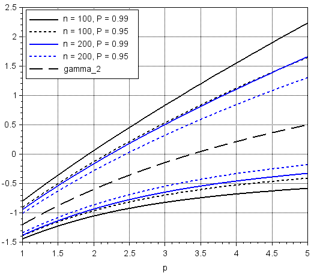
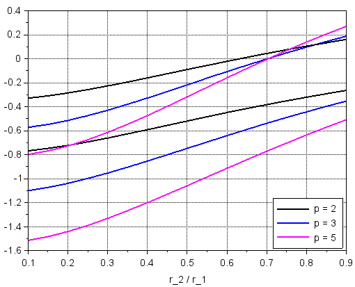
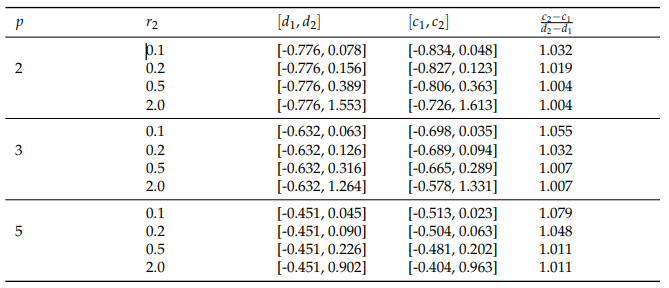

1. Confidence bands for a kurtosis sample estimator (confidence level: 95%, 99%). Distribution: symmetric TSP(p). Sample lengths n = 100, 200.

    

2. Confidence bands for a skewness sample estimator (confidence level: 95%). Distribution: asymmetric TSP(p) defined on [r1, r2], Sample length n = 200.

    

3. Coverage intervals [c1, c2] and shortest coverage intervals [d1, d2] for asymmetric TSP(p) defined on [r1, r2] (for scale assume r1 == 1, x0 == 0), probability level of 95%

    

